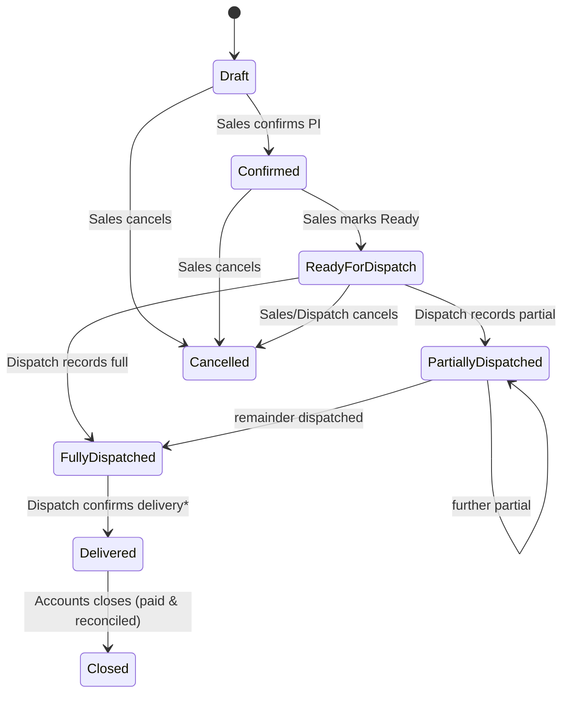
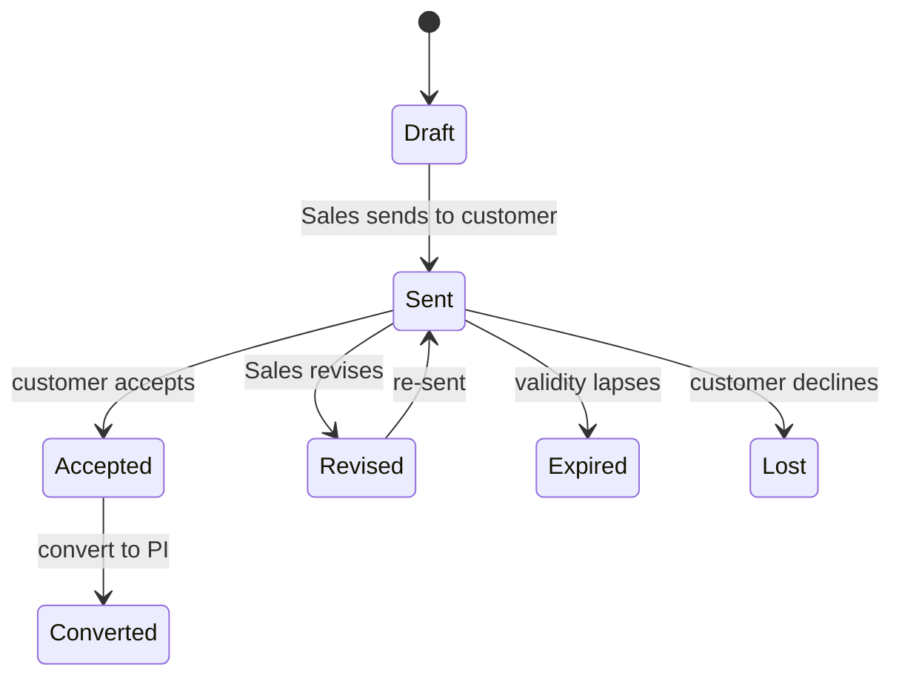
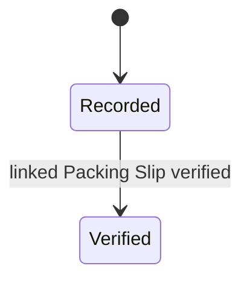
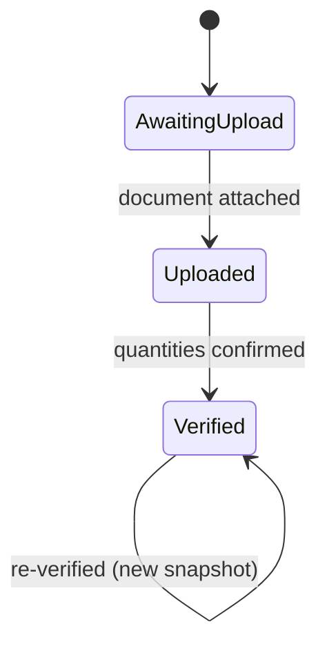
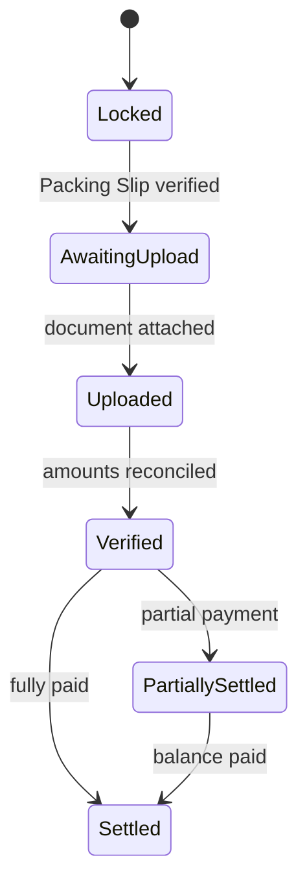
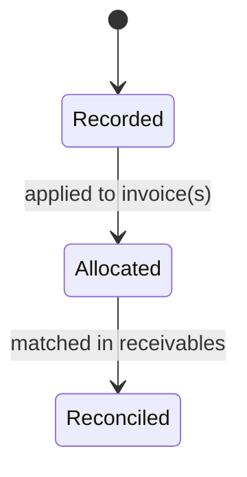
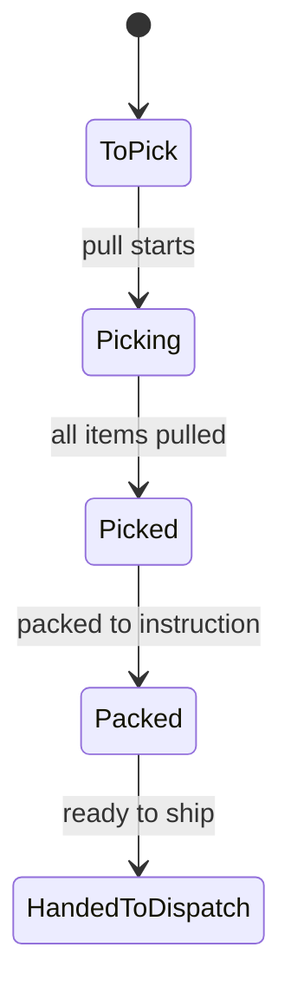

# State Machines

| | |
|---|---|
| **Version** | 0.1 |
| **Status** | 📝 Draft |
| **Last Updated** | 27 Jun 2026 |
| **Related ADRs** | ADR-0001, ADR-0002 |
| **Related Modules** | Sales · Dispatch · Warehouse · Accounts |

> Every major object has a defined lifecycle. This document lists each object's
> states, **every valid transition**, the **trigger**, and **which department
> performs it**. Transitions not listed are illegal and rejected by the
> business-logic layer. Statuses that are *derived* (computed from documents) are
> marked; the rest are explicit transitions.

---

## Sales Order  *(status derived from its documents)*

| From | To | Trigger | Performed by |
|---|---|---|---|
| — | Draft | Order created (from quotation or direct) | Sales |
| Draft | Confirmed | PI confirmed (lines frozen) | Sales |
| Confirmed | Ready for Dispatch | Handover completed | Sales |
| Ready for Dispatch | Partially Dispatched | First partial shipment recorded | Dispatch |
| Ready for Dispatch | Fully Dispatched | All units shipped in one go | Dispatch |
| Partially Dispatched | Partially / Fully Dispatched | Further shipment recorded | Dispatch |
| Fully Dispatched | Delivered | Delivery confirmed **(gated\*)** | Dispatch |
| Delivered | Closed | Fully invoiced, reconciled & settled | Accounts |
| Draft / Confirmed / Ready | Cancelled | Order cancelled | Sales (or Dispatch pre-ship) |

> **\* Gated:** `Fully Dispatched → Delivered` requires the **Packing Slip** and
> **Sales Invoice** to be verified (see their machines below). This is the
> reconciliation gate from ADR-0002. *Partially/Fully Dispatched, Delivered* are
> **derived** from dispatch records + delivery; *Confirmed/Ready/Closed/Cancelled*
> are explicit transitions.

> **Today vs. target:** the current app uses `Pending` for what this machine calls
> `Confirmed` (there is no separate Quotation/Draft yet) and does not yet model
> `Closed`. The backend introduces Draft/Confirmed/Closed explicitly.

---

## Quotation

| From | To | Trigger | Performed by |
|---|---|---|---|
| Draft | Sent | Quotation issued | Sales |
| Sent | Revised → Sent | Price/line change | Sales |
| Sent | Accepted | Customer accepts | Sales |
| Accepted | Converted | PI created (read-only thereafter) | Sales |
| Sent | Expired / Lost | Lapsed / declined | Sales |

---

## Dispatch Record  *(append-only)*

| From | To | Trigger | Performed by |
|---|---|---|---|
| — | Recorded | Shipment entered (LR, vehicle, quantities) | Dispatch |
| Recorded | Verified | Its Packing Slip is verified | Dispatch |

A Dispatch Record is never edited; it only gains a verified marker when its
packing slip is confirmed.

---

## Packing Slip  *(quantity verification)*

| From | To | Trigger | Performed by |
|---|---|---|---|
| — | Awaiting Upload | Order Fully Dispatched | Dispatch |
| Awaiting Upload | Uploaded | Slip document attached | Dispatch |
| Uploaded | Verified | Quantities confirmed (variance recorded; Sales notified) | Dispatch |

On `Verified` the slip locks; it **unlocks the Invoice** step. Foot Mats / Car
Sets must be manually entered before verification.

---

## Sales Invoice  *(financial verification)*

| From | To | Trigger | Performed by |
|---|---|---|---|
| Locked | Awaiting Upload | Packing Slip verified | Accounts |
| Awaiting Upload | Uploaded | Invoice document attached | Accounts |
| Uploaded | Verified | PI ↔ invoice reconciled (variance recorded) | Accounts |
| Verified | Partially Settled / Settled | Payment(s) allocated | Accounts |

---

## Payment  *(append-only)*

| From | To | Trigger | Performed by |
|---|---|---|---|
| — | Recorded | Receipt entered | Accounts |
| Recorded | Allocated | Applied to one/more invoices | Accounts |
| Allocated | Reconciled | Matched against receivables | Accounts |

---

## Warehouse Pick/Pack Task  *(planned)*

| From | To | Trigger | Performed by |
|---|---|---|---|
| — | To Pick | Order Ready for Dispatch | Warehouse |
| To Pick | Picking → Picked | Pull begins / completes | Warehouse |
| Picked | Packed | Packed to instruction | Warehouse |
| Packed | Handed to Dispatch | Load ready | Warehouse |

---

## Cross-object rules

1. **Illegal transitions are rejected** by the business-logic layer, not just the
   UI; the API returns a clear error (see [`api-strategy.md`](./api-strategy.md)).
2. **Derived statuses** (order fulfilment) are recomputed from documents on every
   read — never set directly.
3. **Every transition emits an event** (see [`event-system.md`](./event-system.md))
   and writes an audit entry, in the same transaction as the state change.
4. **Gates are explicit:** delivery depends on packing-slip + invoice verification;
   invoicing depends on packing-slip verification.
