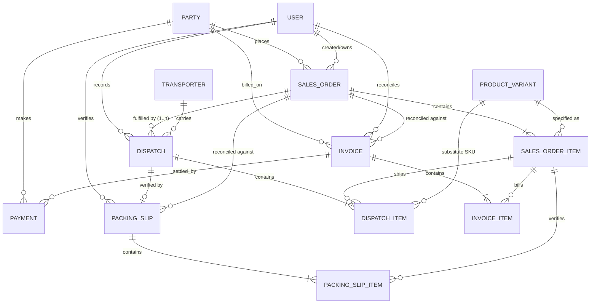

# Conceptual & Logical Data Model

| | |
|---|---|
| **Version** | 1.0 |
| **Status** | ✅ Conceptual (logical model — no SQL yet) |
| **Last Updated** | 27 Jun 2026 |
| **Related ADRs** | ADR-0001, ADR-0002 |
| **Related Modules** | All |

> **Scope:** entities, relationships and lifecycles — **not** a SQL schema. Field
> lists indicate intent, not columns. The model follows the core invariants: the
> **Sales Order is immutable**, and every later stage is a **new linked document**
> (never an overwrite). Fulfilment, billing and payment are separate document
> chains that all reconcile back to the Sales Order.

---

## Entity-relationship overview



## Document chains (parent → child)

```
Sales Order  → Sales Order Items
Dispatch     → Dispatch Items
Packing Slip → Packing Slip Items
Invoice      → Invoice Items
```

A **parent** owns the lifecycle of its **children** (create/verify them together);
children never exist without their parent. Every child also points back to the
immutable **Sales Order Item**, which is how variance — quantity or financial — is
always measured against original intent.

---

## Entities (logical)

### Party
- **Purpose.** The customer (or supplier) Native trades with; the anchor for
  orders and receivables.
- **Primary relationships.** Places Sales Orders; billed on Invoices; makes
  Payments.
- **Parent / Child.** Root entity (no parent). Conceptual children: its orders,
  invoices and payments.
- **Lifecycle.** Created → Active → (Watchlist / Dormant). Long-lived; never
  deleted (history depends on it).

### Product Variant (+ SKU)
- **Purpose.** A fully-specified product (Product · Model · Backing · Colour ·
  Size) identified by a stable SKU — the atomic sellable/stockable unit. See
  [`product-hierarchy.md`](./product-hierarchy.md).
- **Primary relationships.** Specified by Sales Order Items; shipped by Dispatch
  Items (incl. as a substitute); stocked by Inventory (planned).
- **Parent / Child.** Parent is the Product family/catalogue path; it is the leaf
  of the hierarchy.
- **Lifecycle.** Defined in catalogue → Active → Discontinued. SKU is immutable
  once assigned.

### Sales Order (PI)  *(immutable after confirmation)*
- **Purpose.** The authoritative record of what the customer requested; the
  reference everything downstream reconciles to.
- **Primary relationships.** Belongs to a Party and a User (salesperson);
  fulfilled by 0..n Dispatches; reconciled against Packing Slips and Invoices.
- **Parent / Child.** **Parent of Sales Order Items.**
- **Lifecycle.** `Pending → Ready for Dispatch → Partially/Fully Dispatched →
  Delivered` (status **derived**, not stored). Terminal: `Cancelled`, `Repeat`.
  Header/items frozen after confirmation.

### Sales Order Item  *(immutable)*
- **Purpose.** One ordered line: a Variant + ordered quantity + commercials (bill
  rate, actual rate, freight, taxable, total).
- **Primary relationships.** References a Product Variant; referenced by Dispatch
  Items, Packing Slip Items and Invoice Items.
- **Parent / Child.** **Child of Sales Order.** Parent (by reference) of its
  dispatch/packing/invoice lines.
- **Lifecycle.** Created with the order; never mutated. Its *fulfilment* is derived
  from the dispatch/packing chain.

### Dispatch  *(append-only)*
- **Purpose.** A single physical shipment of an order (one of possibly many).
- **Primary relationships.** Belongs to a Sales Order; carried by a Transporter;
  recorded by a User; optionally verified by a Packing Slip.
- **Parent / Child.** **Parent of Dispatch Items.** Child (by reference) of the
  Sales Order.
- **Lifecycle.** Created when goods leave → (verified by packing slip). Never
  edited; a correction is a new record or the packing-slip verified figures.

### Dispatch Item
- **Purpose.** What was loaded for one order line in one shipment — raw/uncapped
  quantity, or a substitution (a different Variant shipped instead).
- **Primary relationships.** References a Sales Order Item; may reference a
  substitute Product Variant.
- **Parent / Child.** **Child of Dispatch.**
- **Lifecycle.** Created and frozen with its Dispatch.

### Packing Slip  *(quantity verification)*
- **Purpose.** The verified statement of what physically left the factory,
  reconciled **PI ↔ Packing Slip**. Holds the uploaded document reference,
  verified totals and classified variance.
- **Primary relationships.** Verifies a Dispatch (the shipped goods); reconciled
  against the Sales Order; raises the variance notification to Sales.
- **Parent / Child.** **Parent of Packing Slip Items.**
- **Lifecycle.** `Awaiting → Uploaded → Verified ✓`. Append-only once verified
  (re-verification creates a new verified state, history retained).

### Packing Slip Item
- **Purpose.** The verified quantity for one order line (incl. manual Foot
  Mat / Car Set entries and substitutions).
- **Primary relationships.** References a Sales Order Item.
- **Parent / Child.** **Child of Packing Slip.**
- **Lifecycle.** Created with its Packing Slip.

### Invoice  *(financial verification)*
- **Purpose.** The sales invoice raised by Accounts, reconciled **PI ↔ Invoice**
  (totals, rates, taxable, amount variance). Holds invoice number, document
  reference and totals.
- **Primary relationships.** Belongs to a Party; reconciled against the Sales
  Order; settled by Payments.
- **Parent / Child.** **Parent of Invoice Items.**
- **Lifecycle.** `Awaiting → Uploaded → Verified ✓ → (Settled by payments)`.
  Locked until the Packing Slip is verified.

### Invoice Item
- **Purpose.** One billed line — rate and amount — compared to the PI line.
- **Primary relationships.** References a Sales Order Item.
- **Parent / Child.** **Child of Invoice.**
- **Lifecycle.** Created with its Invoice.

### Payment
- **Purpose.** A receipt against a party / invoice (amount, date, method, ref).
- **Primary relationships.** Made by a Party; settles one or more Invoices.
- **Parent / Child.** References Party and Invoice(s); no children.
- **Lifecycle.** Recorded → Allocated → (Reconciled in receivables). Append-only.

### User
- **Purpose.** An actor with a role (Sales / Dispatch / Warehouse / Accounts /
  Management); drives the audit trail.
- **Primary relationships.** Owns Sales Orders; records Dispatches; verifies
  Packing Slips; reconciles Invoices.
- **Parent / Child.** Root entity; appears as *by whom* on documents.
- **Lifecycle.** Active → Disabled. Referenced for audit, never deleted.

### Transporter
- **Purpose.** A carrier captured at handover and reused across dispatches.
- **Primary relationships.** Carries many Dispatches.
- **Parent / Child.** Root reference entity.
- **Lifecycle.** Added on first use → reused. Long-lived.

---

## Cross-cutting rules (reflected in the model)

- **One order → many dispatches** (partial shipments). Fulfilment is the *sum* of
  dispatch items, never a stored field on the order.
- **Two separate verification chains:** Dispatch → Packing Slip checks
  *quantities*; Order → Invoice checks *money*. They never substitute for each
  other (ADR-0002).
- **Every child references the immutable Sales Order Item**, so variance is always
  computed against original intent.
- **No document is overwritten** — corrections create new linked records, keeping
  *requested → shipped → billed → paid* fully reconstructable.

See [`business-logic-principles.md`](../architecture/business-logic-principles.md)
for the invariants this model enforces.
