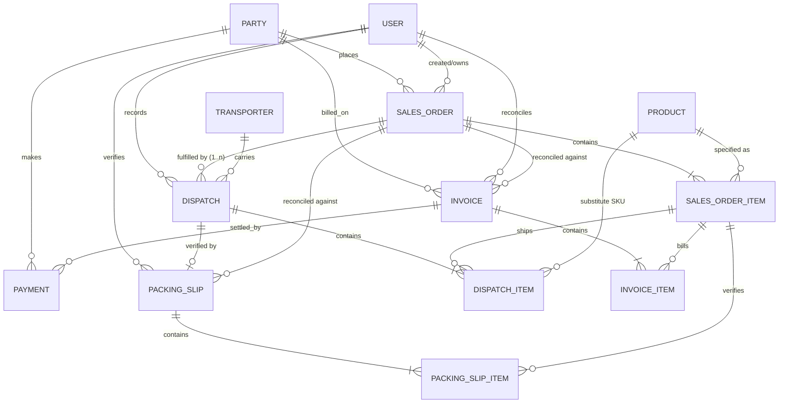

# Conceptual ER Diagram

> **Last updated:** 2026-06-27
> **Scope:** Conceptual only. This describes *entities and relationships*, not a
> SQL schema. Field lists are indicative of intent, not column definitions. The
> physical schema will be designed separately once the model stabilises.

## Overview

Native's data model follows the core principles: the **Sales Order is
immutable**, and every later stage is a **new document linked to the previous
one** (never an overwrite). Fulfilment, billing and payment are separate document
chains that all reconcile back to the Sales Order.

## Entities

### Party
The customer (or supplier). Holds identity (name, code), and is the anchor for
receivables (opening, billed, received, outstanding, fiscal-year history).
- *Relationships:* places many Sales Orders; billed on many Invoices; makes many
  Payments.

### Product
The catalogue item, modelled as a hierarchy rather than a flat name (see
[`product-hierarchy.md`](./product-hierarchy.md)): Category/Product → Model →
Backing → Colour → Width × Length, plus a unit type (rolls / pcs / sets).
- *Relationships:* specified by Sales Order Items; may appear as a substitute on
  Dispatch Items.

### Sales Order  *(immutable after confirmation)*
The PI — the authoritative request. Header: PI #, party, party code, salesperson
(POC), PI date, totals, derived status.
- *Relationships:* belongs to a Party and a User (salesperson); contains many
  Sales Order Items; fulfilled by 0..n Dispatches; reconciled against Packing
  Slips and Invoices.

### Sales Order Item  *(immutable)*
One ordered line: product hierarchy + quantity, units, bill rate, actual rate,
freight, taxable value, total.
- *Relationships:* references a Product; shipped by Dispatch Items; verified by
  Packing Slip Items; billed by Invoice Items.

### Dispatch  *(append-only)*
A single shipment of an order. Sequence #, dispatch datetime, LR/docket, vehicle,
driver, transporter, remarks, recorded-by.
- *Relationships:* belongs to a Sales Order (many per order = partial dispatches);
  carried by a Transporter; recorded by a User; contains many Dispatch Items.

### Dispatch Item
What was physically loaded for one order line in one shipment: shipped quantity
(raw/uncapped), or a substitution (a different Product shipped instead).
- *Relationships:* belongs to a Dispatch; references a Sales Order Item; may
  reference a substitute Product.

### Packing Slip  *(quantity verification)*
The verified record of what left the factory, reconciled against the order.
Uploaded document reference, verified totals, classified variance (reduced /
increased / substituted / total delta), verified-at, verified-by.
- *Relationships:* verifies a Dispatch (the shipped goods); reconciled against the
  Sales Order; contains many Packing Slip Items.

### Packing Slip Item
The verified quantity for one order line (including manual entries for Foot
Mats / Car Sets, and substitutions).
- *Relationships:* belongs to a Packing Slip; references a Sales Order Item.

### Invoice  *(financial verification)*
The sales invoice raised by Accounts, reconciled against the PI. Invoice number,
uploaded document reference, PI total, invoice total, total variance, per-line
issues, verified-at, verified-by.
- *Relationships:* belongs to a Party; reconciled against the Sales Order;
  contains many Invoice Items; settled by Payments.

### Invoice Item
One billed line: rate and amount, compared to the PI line's rate and amount.
- *Relationships:* belongs to an Invoice; references a Sales Order Item.

### Payment
A receipt against a party / invoice. Amount, date, method, reference.
- *Relationships:* made by a Party; settles one or more Invoices.

### User
An actor in the system with a role (Sales / Dispatch / Warehouse / Accounts /
Management). Drives the audit trail (created/owned/recorded/verified by).
- *Relationships:* owns Sales Orders; records Dispatches; verifies Packing Slips;
  reconciles Invoices.

### Transporter
A carrier; captured at handover, reused across dispatches.
- *Relationships:* carries many Dispatches.

## Key relationship notes (the document chain)

- **One order → many dispatches** (partial shipments). Fulfilment is the sum of
  dispatch items, never a stored field on the order.
- **Dispatch → Packing Slip** verifies *quantities*; **Order → Invoice** verifies
  *money*. The two verification chains are deliberately separate (a packing slip
  is never used to check amounts; an invoice is never used to check quantities).
- **Every chain references the immutable Sales Order Item**, which is how variance
  (quantity or financial) is always computed against original intent.
- **No document is overwritten** — corrections create new linked records, so the
  history of requested vs. shipped vs. billed vs. paid is always reconstructable.
