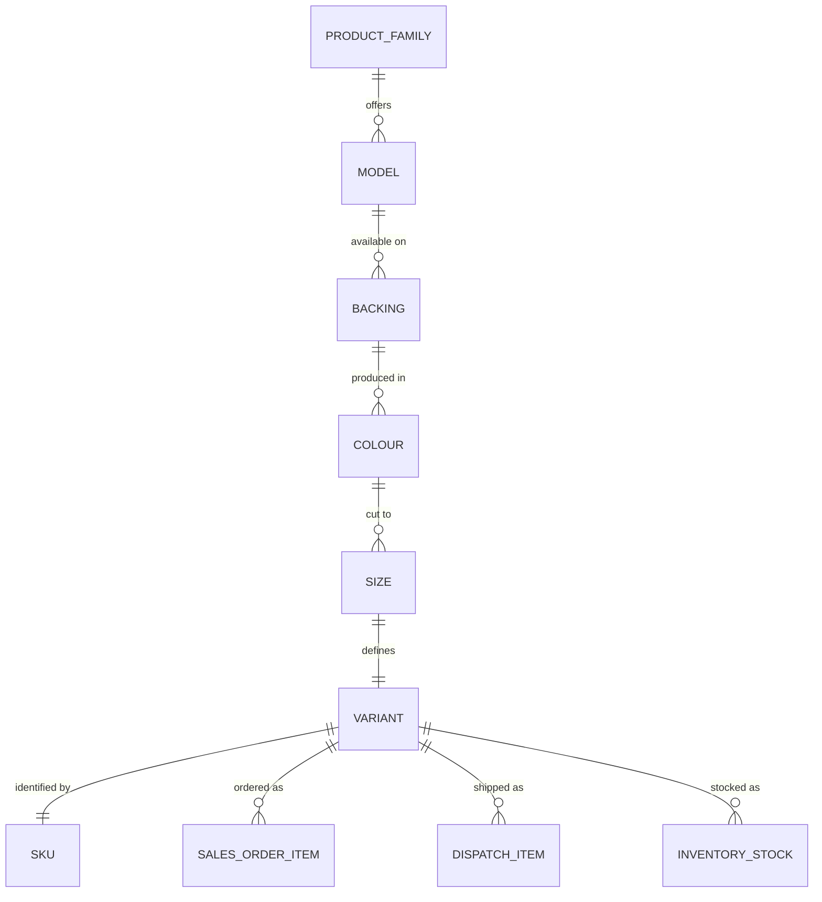

# Product Hierarchy

| | |
|---|---|
| **Version** | 1.0 |
| **Status** | ✅ Implemented (catalogue entity planned) |
| **Last Updated** | 27 Jun 2026 |
| **Related ADRs** | ADR-0001 |
| **Related Modules** | Sales Orders · Dispatch · Warehouse · Inventory · Production · Reporting |

> The product hierarchy is one of the most important parts of Native. **Sales,
> Dispatch, Warehouse, Inventory, Production and Reporting all depend on it.** A
> product is described by a set of distinct, labelled attributes — never a single
> concatenated name — so that grouping, variance, stock and reporting stay
> precise. This document defines each level, the *Variant* and *SKU* concepts,
> the relationships between them, and worked examples using our actual products.

---

## The hierarchy at a glance

```
Product (Category)          e.g. Rolls
   └── Model                e.g. CIRRO
         └── Backing        e.g. Spike
               └── Colour   e.g. P.Green
                     └── Size  (Width × Length)   e.g. 2ft × 12m
                            └── = one VARIANT  →  one SKU
```

A **Variant** is a fully-specified path through all six levels. It is the
sellable, dispatchable and stockable unit, and it is what receives a **SKU**.

## Levels defined

### 1. Product (Category)
The broad product family — the top of the hierarchy and the primary axis for
units and reporting.

Current families: **Rolls, S-Mat, Foot Mat, Turf, Grass, WIRE, Car Set,
Monograss, Backing Sheet, STRIPE, Heavy.**

Each family has a natural counting unit (see [Units](#units-product-aware-counting)):
Rolls/S-Mat/Turf/Grass/WIRE/Monograss → **rolls**, Foot Mat → **pcs**, Car Set → **sets**.

### 2. Model
The design / series within a product family.

Examples: **NIMBO, CIRRO, STRATO, ALTO, TEFNO-400 / 600 / 900, Kappa Turf,
25mm / 35mm / 40mm, WELCOME, LOCK, Monograss, Water Absorbent, Heavy Duty.**

A model is meaningful within its product family (e.g. *CIRRO*, *NIMBO*, *STRATO*,
*ALTO* are Roll models; *Kappa Turf* is a Turf model; the *25/35/40mm* models
describe pile/grass heights).

### 3. Backing
The base / underside construction of the piece.

Examples: **Spike, Diamond, Turf, S-Mat, WIRE, Single Backing, Double Backing,
LOCK, STRIPE, Welcome, Bathroom Mats, CHAIN, BOX, HOLLOW.**

The same model can be offered on different backings (e.g. *ALTO / Spike* and
*ALTO / Diamond* both exist).

### 4. Colour
The colour / pattern of the variant.

Examples: **P.Green, Red, Black, Grey, Light Grey-Black, Beige-Brown, Blue,
Green-Black, Red-Black, L.Grey, D.Grey, Brown, Mixed, Single Mixed, Double
Mixed.**

Colours may be solids (*Black*, *Red*), two-tones (*Light Grey-Black*) or pattern
families (*Single Mixed*, *Double Mixed*). Colour is the axis along which
**dispatch variance** is most often expressed (a colour-mix change).

### 5. Width & 6. Length (Size)
The physical dimensions. Together they form the **Size**.

- **Width** examples: *2ft, 4ft, 3ft* (rolls); *38cm, 40cm, 45cm, 60cm, 16in,
  14in, 18in* (mats); *2mtr, 1mtr* (wide goods); *3pc, 5pc* (sets).
- **Length** examples: *15m, 12m, 10m, 25m, 9m, 24m* (rolls); *58cm, 60cm, 75cm,
  90cm, 24in* (mats); *5pc, 3pc* (sets).

> **Note:** for **Car Sets**, width/length encode the **piece count** of the set
> (e.g. `5pc × 5pc` = a 5-piece set), not a linear measurement. For **Foot Mats**,
> size is the cut dimension (e.g. `38cm × 60cm`).

## Variant

A **Variant** = `Product + Model + Backing + Colour + Width + Length`.

It is the atomic unit the rest of Native operates on:

- A **Sales Order Item** specifies exactly one Variant + an ordered quantity.
- A **Dispatch Item** ships a Variant (or a substitute Variant).
- A **Packing Slip Item** verifies a Variant's shipped quantity.
- **Inventory** (planned) tracks stock-on-hand per Variant.

Two line items are "the same product" only if all six attributes match.

## SKU generation

Today line items are described by their attributes; there is no stored SKU. The
target model assigns each Variant a **deterministic, stable SKU** generated from
its attributes, so the same Variant always resolves to the same code across
Sales, Dispatch, Inventory and Production.

**Proposed format:**

```
<CAT>-<MODEL>-<BACK>-<COLOUR>-<WIDTH>x<LENGTH>
```

Using short codes per level (illustrative — the canonical code tables live in the
future Product Catalogue):

| Level | Example value → code |
|---|---|
| Category | Rolls→`RLL`, Foot Mat→`FMT`, Turf→`TRF`, Car Set→`CST`, S-Mat→`SMT`, WIRE→`WIR` |
| Model | NIMBO→`NMB`, CIRRO→`CIR`, STRATO→`STR`, ALTO→`ALT`, Kappa Turf→`KPT`, TEFNO-400→`TF4` |
| Backing | Spike→`SPK`, Diamond→`DMD`, Turf→`TRF`, S-Mat→`SMT`, Double Backing→`DB` |
| Colour | P.Green→`PGN`, Black→`BLK`, Light Grey-Black→`LGB`, Red→`RED`, Double Mixed→`DMX` |
| Size | 2ft×12m→`2Fx12M`, 4ft×15m→`4Fx15M`, 38cm×60cm→`38Cx60C`, 5pc→`5PC` |

**Rules:**

- A SKU is **generated once** when a Variant first appears and is **immutable**
  thereafter (even if display labels are later cleaned up).
- SKUs are the **stable reference** used by substitutions, inventory movements and
  reporting — never the display string.
- Generation is deterministic: identical attributes → identical SKU; collisions
  are impossible because the SKU encodes the full variant path.

## Worked examples (actual products)

| Product | Model | Backing | Colour | Size | Unit | Example SKU |
|---|---|---|---|---|---|---|
| Rolls | NIMBO | Spike | Light Grey-Black | 4ft × 12m | rolls | `RLL-NMB-SPK-LGB-4Fx12M` |
| Rolls | CIRRO | Spike | P.Green | 2ft × 12m | rolls | `RLL-CIR-SPK-PGN-2Fx12M` |
| Rolls | ALTO | Diamond | Beige-Brown | 4ft × 15m | rolls | `RLL-ALT-DMD-BGB-4Fx15M` |
| Turf | Kappa Turf | Turf | P.Green | 2ft × 15m | rolls | `TRF-KPT-TRF-PGN-2Fx15M` |
| Foot Mat | ALTO | Spike | Double Mixed | 38cm × 60cm | pcs | `FMT-ALT-SPK-DMX-38Cx60C` |
| Car Set | STRATO | Spike | Black | 5pc × 5pc | sets | `CST-STR-SPK-BLK-5PC` |

### Display de-duplication rule

When showing the hierarchy, any attribute whose value merely **repeats the
product** is dropped so the same word never appears twice (e.g. backing "Turf"
under product "Turf" is hidden; a model equal to the product is hidden). The
Product is always shown first as the lead. This is **display-only** — the
underlying Variant/SKU still carries every attribute.

## Units (product-aware counting)

Quantities are counted in category-appropriate units, not a generic "units":

- Category contains **"foot"** → **pcs** (Foot Mats).
- Category contains **"set"** → **set / sets** (Car Sets).
- Everything else (Rolls, **S-Mat**, Turf, Grass, WIRE, Monograss …) → **roll / rolls**.

Singular/plural follows the quantity (`1 roll`, `3 rolls`). A mixed group spanning
different units uses a neutral "units" label for its shared total.

> S-Mat is counted in **rolls**, not pieces — the rule keys on "foot"/"set" only,
> so S-Mat correctly resolves to rolls despite matching "mat".

## Relationships



- The hierarchy is a **path**: a Variant references exactly one value at each
  level.
- Cardinalities are conceptual: a Product family offers many Models; a Model is
  available on one or more Backings; a Backing in one or more Colours; a Colour in
  one or more Sizes. Each leaf path is a Variant with a single SKU.
- Valid combinations will be constrained by the future **Product Catalogue**
  (today any combination present in an order is treated as valid).

## Line-item fields

Alongside the hierarchy, each Sales Order Item carries: `qty` (ordered, immutable),
`units` (underlying measure, e.g. running length), `billRate` / `actualRate`,
`freight`, `taxable`, `total`, plus `width` / `length`.

## Grouping in the UI

All operational views group by:

```
Product → Model · Backing · Size → Colours (variant rows)
```

This shared grouping backs dispatch entry, packing-slip verification, dispatch
history and the load sheet — each colour is a variant row under its
Product/Model/Backing/Size group, and variance is computed per colour (per
Variant).

## Special handling

- **Foot Mats & Car Sets** are not listed on our packing slips; their quantities
  are flagged `manual` and entered by hand during packing-slip verification (see
  [`../architecture/dispatch.md`](../architecture/dispatch.md)).
- **Substitutions** reference a different Variant/SKU recorded against the
  dispatch/packing slip — never an edit to the ordered line.

## Future

- A first-class **Product Catalogue** entity: canonical code tables, valid
  Model/Backing/Colour/Size combinations, per-category unit definitions, and
  authoritative SKU assignment — replacing today's attribute-implied products and
  the code-based unit rule.
- Catalogue-validated order entry and substitutions.
- Variant-level **Inventory** stock and **Production** planning keyed on SKU.
